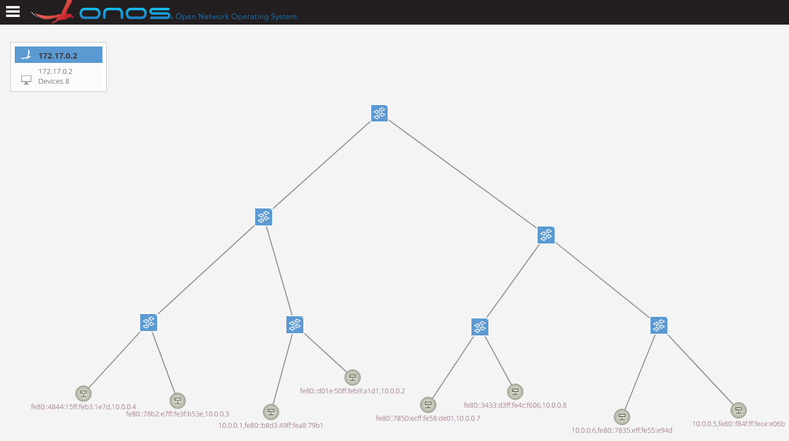
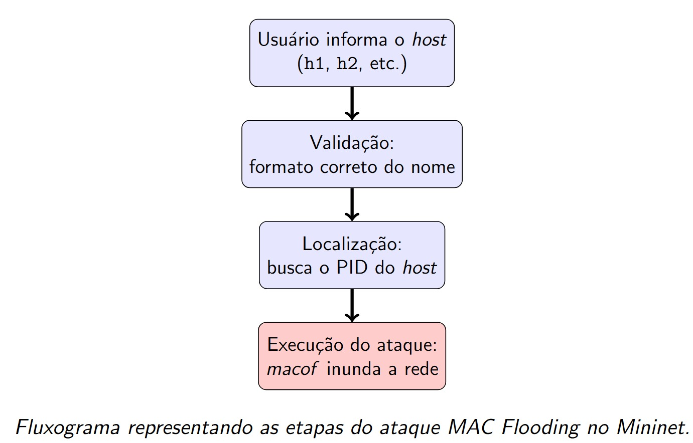

## Network Topology
For our network topology, we chose a common ladder (mesh-like) structure, where switches are interconnected in a stepwise fashion. This design is widely used because it provides scalability, redundancy, and clear hierarchical organization.

```bash
sudo python3 topologia.py
.
.
.
mininet> pingall
```


---

## Mininet Attacks

### MAC Flood Attack ("macof")

- From a host connected to the switch: execute the attack (e.g., macof) on a host interface to generate traffic that the switch must process. Flooding can affect the switch.  
- Manipulate the switch via OVS: use `ovs-ofctl` commands to modify rules, simulate floods via OpenFlow, etc.

Process Flow:


```bash
sudo ./atq_macof.sh
.
.
.
Enter the host to be attacked(ex: h1,h2,h3 ... ): 
```
### Blackhole Attack

- Similar methodology, can be implemented by dropping traffic or rerouting flows.
