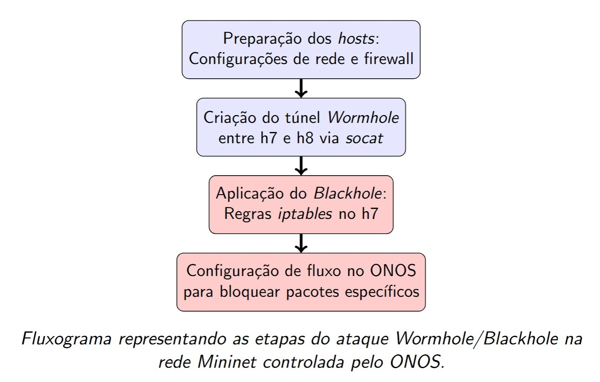
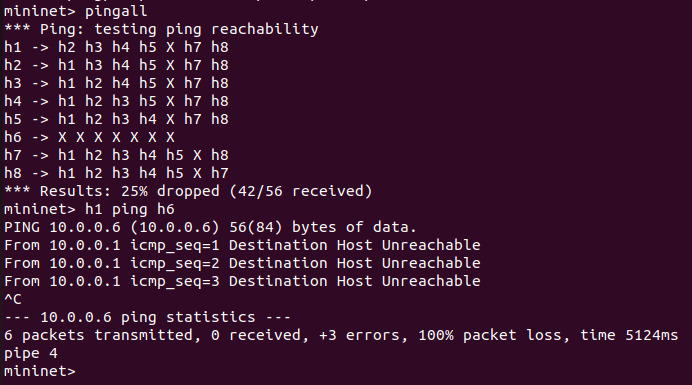

## Network Topology
For our network topology, we chose a common ladder (mesh-like) structure, where switches are interconnected in a stepwise fashion. This design is widely used because it provides scalability, redundancy, and clear hierarchical organization.

---
## Building the Topology

```bash
sudo python3 topologia.py
...

mininet> pingall
```


---

## Mininet Attacks

### Blackhole Attack

**Purpose:** Drop all traffic destined for a specific host or network segment, effectively making it unreachable without alerting the source. This simulates a denial-of-service by silently discarding packets.

**Process Flow:**




In another terminal, we run the attack script:

```bash
sudo ./atq_blackhole.sh
...

```
***
Redirect all traffic destined for a specific host (h6) through a tunnel from another host (h5), effectively isolating h6 from the rest of the network. This creates a “blackhole”, where h6 loses communication with all other hosts.

---
## Attack Impact
Redirects or drops all traffic to a target host (e.g., h6), isolating it from the rest of the network. This disrupts connectivity for the affected host and may impact services relying on communication with it.


Visually, the network appears unaffected in the ONOS GUI, giving the impression that everything is functioning normally. However, when tested from the terminal, the impact of the attack becomes evident:

```bash
mininet> pingall
```


