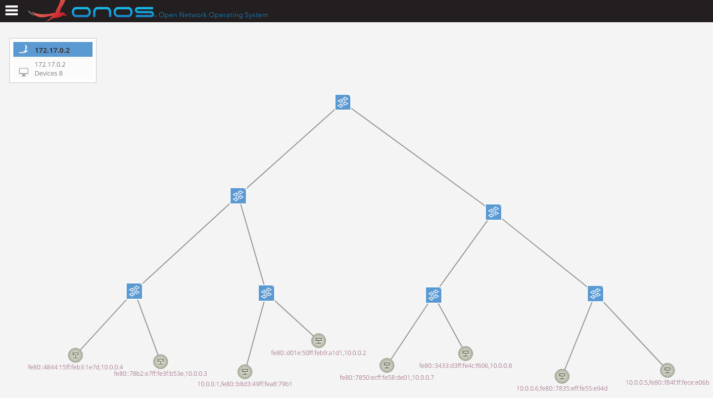
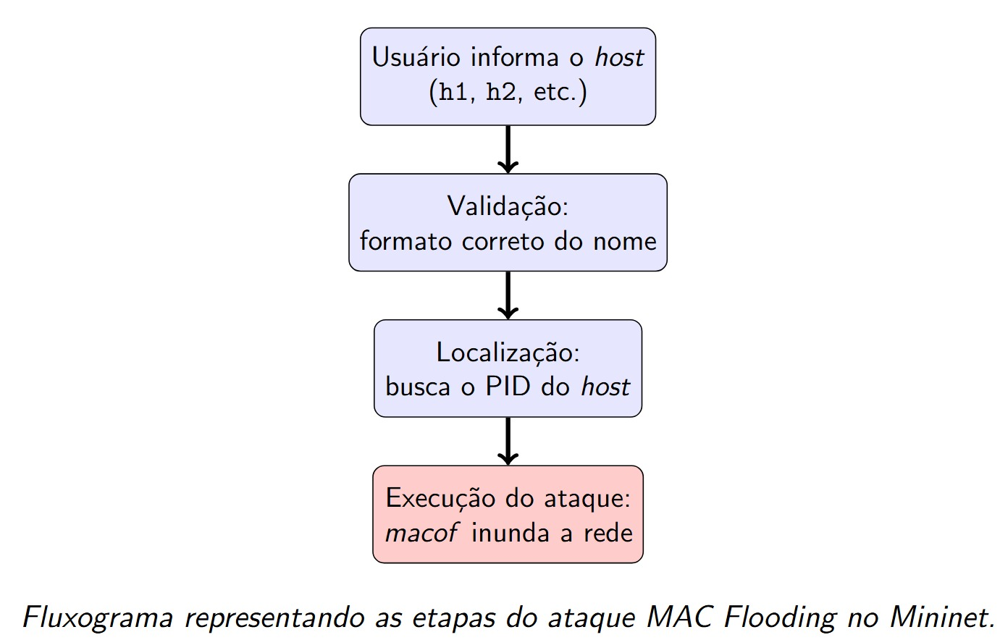

## Network Topology
For our network topology, we chose a common ladder (mesh-like) structure, where switches are interconnected in a stepwise fashion. This design is widely used because it provides scalability, redundancy, and clear hierarchical organization.

```bash
sudo python3 topologia.py
.
.
.
mininet> pingall
```


---

## Mininet Attacks

### MAC Flood Attack ("macof")

- From a host connected to the switch: execute the attack (e.g., macof) on a host interface to generate traffic that the switch must process. Flooding can affect the switch.  
- Manipulate the switch via OVS: use `ovs-ofctl` commands to modify rules, simulate floods via OpenFlow, etc.

Process Flow:


```bash

ctrl+shift+n
sudo ./atq_macof.sh
.
.
.
Enter the host to be attacked(ex: h1,h2,h3 ... ): #h5

```


---
## Attack Impact
The attack can disrupt normal network operations, causing degraded performance, packet loss, or even temporary network outages. Depending on the type of attack, it may affect specific hosts, switches, or the entire topology, compromising connectivity and potentially exposing sensitive data.


```bash
mininet> pingall
```


```bash
mininet> h1 ping h5
```


